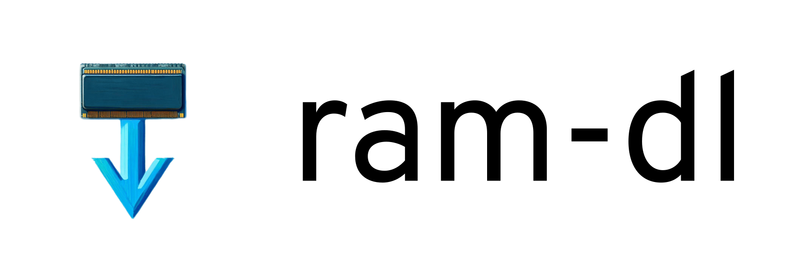

# ram-dl



A tool to download more RAM (yes, seriously!)

[](https://github.com/pojntfx/ram-dl/actions/workflows/hydrun.yaml)
[](https://matrix.to/#/#ram-dl:matrix.org?via=matrix.org)

## Overview

`ram-dl` is a tool that allows you to **upload** and **download** RAM to/from your system. Well, sort of :P

It is mostly intended as a tech demo for [r3map](https://github.com/pojntfx/r3map), a library for efficient distributed `mmap` with mounting and migration support, and [go-nbd](https://github.com/pojntfx/go-nbd), a pure Go NBD server and client library. Despite this it can however also be of use for a few experimental use cases, such as:

- **Extending a system's memory capacity over the network**: By leveraging the fast [fRPC](https://frpc.io/) RPC framework, you can use `ram-dl` and `ram-ul` to expand your local system's RAM (effectively **"downloading RAM"**) without having to use local disk space or memory.
- **Mounting a remote system's memory**: By allocating a memory region with `ram-ul` (effectively **"uploading RAM"**), it is possible to mount a remote system's RAM to your local system with minimal latency.
- **Getting insights into memory usage and contents**: By inspecting the "downloaded"/mounted memory with `ram-ul`, you can get insights into the contents of a remote system's memory.

`ram-dl` achieves this by essentially doing the following:

1. Starting a `go-nbd` server _and_ client locally with r3map's [Device API](https://pkg.go.dev/github.com/pojntfx/r3map@main/pkg/device)
2. Connecting the NBD _server_ to a remote fRPC backend provided by `ram-ul`
3. Calling `mkswap`, `swapon` and `swapoff`, which enables paging out to the block device provided by the NBD client and thus to the connected remote fRPC backend.

For most real-world use cases, using [r3map](https://github.com/pojntfx/r3map)'s [Mount API](https://pkg.go.dev/github.com/pojntfx/r3map@main/pkg/mount) or [Migration API](https://pkg.go.dev/github.com/pojntfx/r3map@main/pkg/migration) directly is the better (and much faster) option, but if you just want to see the [Download More RAM](https://knowyourmeme.com/memes/download-more-ram) meme implemented in real life, you've come to the right place!

## Installation

Static binaries are available on [GitHub releases](https://github.com/pojntfx/ram-dl/releases).

On Linux, you can install them like so:

```shell
$ curl -L -o /tmp/ram-dl "https://github.com/pojntfx/ram-dl/releases/latest/download/ram-dl.linux-$(uname -m)"
$ curl -L -o /tmp/ram-ul "https://github.com/pojntfx/ram-dl/releases/latest/download/ram-ul.linux-$(uname -m)"
$ sudo install /tmp/ram-dl /usr/local/bin
$ sudo install /tmp/ram-ul /usr/local/bin
```

You can find binaries for more architectures on [GitHub releases](https://github.com/pojntfx/ram-dl/releases).

## Usage

> TL;DR: "Upload" RAM with `ram-ul`, "download" the RAM with `ram-dl`, done!

### 1. Upload RAM

On a remote (or local) system, first start `ram-ul`. This component exposes a memory region, file or directory as a fRPC server:

```shell
$ ram-ul --size 4294967296
2023/06/30 14:52:12 Listening on :1337
```

### 2. Download RAM

On your local system, start `ram-dl`. This will mount the remote system's exposed memory region, file or directory using fRPC and r3map as swap space, and umount it as soon as you interrupt the app:

```shell
$ sudo ram-dl --raddr localhost:1337
2023/06/30 14:54:22 Connected to localhost:1337
2023/06/30 14:54:22 Ready on /dev/nbd0
```

This should give you an extra 4GB of local memory/swap space, without using up significant local memory (or disk space):

```shell
# Before
$ free -h
               total        used        free      shared  buff/cache   available
Mem:            30Gi       7.9Gi       6.5Gi       721Mi        16Gi        21Gi
Swap:          8.0Gi          0B       8.0Gi

# After
$ free -h
               total        used        free      shared  buff/cache   available
Mem:            30Gi       7.9Gi       6.5Gi       717Mi        16Gi        21Gi
Swap:           11Gi          0B        11Gi
```

🚀 **That's it!** We hope you have fun using `ram-dl`, and if you're interested in more like this, be sure to check out [r3map](https://github.com/pojntfx/r3map)!

## Reference

### ram-dl

```shell
$ ram-dl --help
Usage of ram-dl:
  -chunk-size int
    	Chunk size to use (default 4096)
  -chunking
    	Whether the backend requires to be interfaced with in fixed chunks (default true)
  -raddr string
    	Remote address for the fRPC r3map backend server (default "localhost:1337")
  -verbose
    	Whether to enable verbose logging
```

### ram-ul

```shell
$ ram-ul --help
Usage of ram-ul:
  -addr string
    	Listen address (default ":1337")
  -backend string
    	Backend to use (one of [file memory directory]) (default "file")
  -chunk-size int
    	Chunk size to use (default 4096)
  -chunking
    	Whether the backend requires to be interfaced with in fixed chunks in tests (default true)
  -location string
    	Backend's directory (for directory backend) or file (for file backend) (default "/tmp/ram-ul")
  -size int
    	Size of the memory region or file to allocate (default 4294967296)
  -verbose
    	Whether to enable verbose logging
```

## Acknowledgements

- [pojntfx/go-bd](https://github.com/pojntfx/go-nbd) provides the Go NBD client and server.
- [pojntfx/r3map](https://github.com/pojntfx/r3map) provides the device abstraction layer.
- ["We ACTUALLY downloaded more RAM" by LTT](https://www.youtube.com/watch?v=minxwFqinpw) provided the original idea for this demo.

## Contributing

To contribute, please use the [GitHub flow](https://guides.github.com/introduction/flow/) and follow our [Code of Conduct](./CODE_OF_CONDUCT.md).

To build and start a development version of `ram-dl` locally, run the following:

```shell
$ git clone https://github.com/pojntfx/ram-dl.git
$ cd ram-dl
$ make depend
$ make && sudo make install
$ ram-ul
# In another terminal
$ sudo ram-dl
```

Have any questions or need help? Chat with us [on Matrix](https://matrix.to/#/#ram-dl:matrix.org?via=matrix.org)!

## License

ram-dl (c) 2023 Felicitas Pojtinger and contributors

SPDX-License-Identifier: AGPL-3.0
